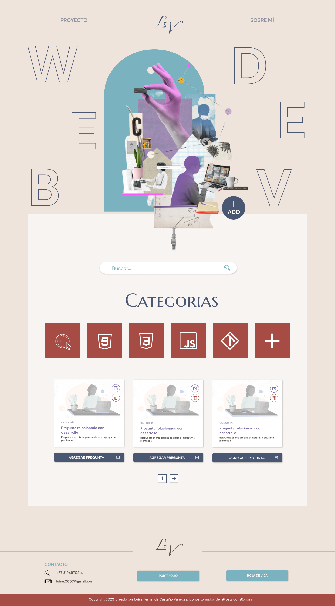

# :octocat: bit-repo_04
---
Nombre del curso: Semillero de especialistas BIT 2023 - cohorte 2
Formación técnica: Fecha de inicio: 2023/08/01  
Formación técnica: Fecha de finalización: 2023/08/31
## Objetivos de aprendizaje
- Consolidar las bases sobre desarrollo web
- Practicar los conceptos aprendidos a través de ejercicios prácticos
- Realización y entrega de un proyecto final que resuelva las preguntas propuestas por el instructor
---
### Temas de estudio
- :open_file_folder: Git y GitHub
- :open_file_folder: html
- :open_file_folder: css
- :open_file_folder: javascript
---
### Proyectos
1. La gruía del Desarrollador web (Requerido)  
Proyecto web donde se dio respuesta a cada una de las [preguntas dadas](/preguntas.md).  
  

2. Calculadora básica (Opcional)  
Proyecto web donde un usuario podrá realizar operaciones aritméticas básicas.
  

3. Página de una boda. Trabajo colaborativo (Opcional)
Proyecto web enfocado en el trabajo colaborativo, donde se practicó el manejo de ramas y el merge a la rama principal.
  
---
### [Página del trabajo final](https://guia-web-dev.netlify.app/)
---
## Software Developer
Built by [Luisa Castaño](https://www.linkedin.com/in/luisacastanovanegas/) :copyright: 2023  
