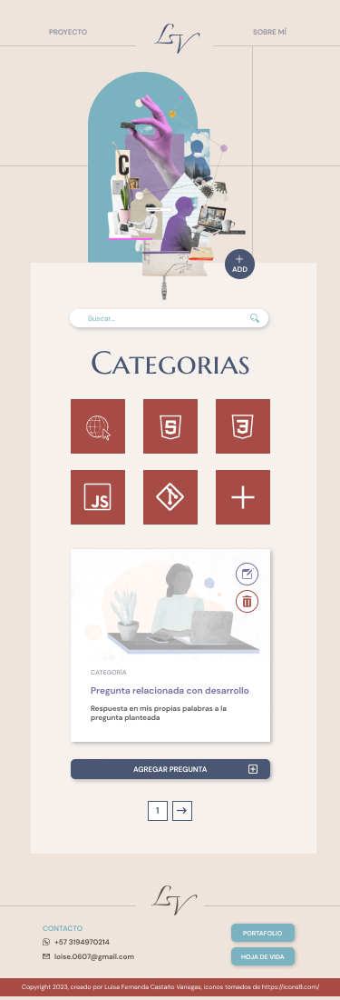
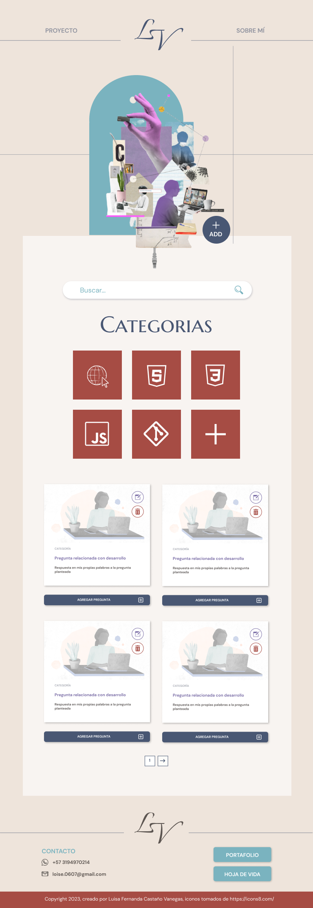

# Proyecto bit-2023_semillero

En el presente repositorio, se consolidarán los aprendizajes obtenidos durante el semillero de especialistas impartido por BIT.

## ¿Qué encontraremos?

- Glosario de términos
- Práctica de HTML
- Práctica de CSS
- Práctica de js

## Mockups

|  |  |  |
|:----------------------------------------:|:------------------------------------------:|:--------------------------------------------:|
|              Diseño movil                |              Diseño para tablet            |             Diseño para desktop              |

### Author
Luisa Fernanda Castaño Vanegas 